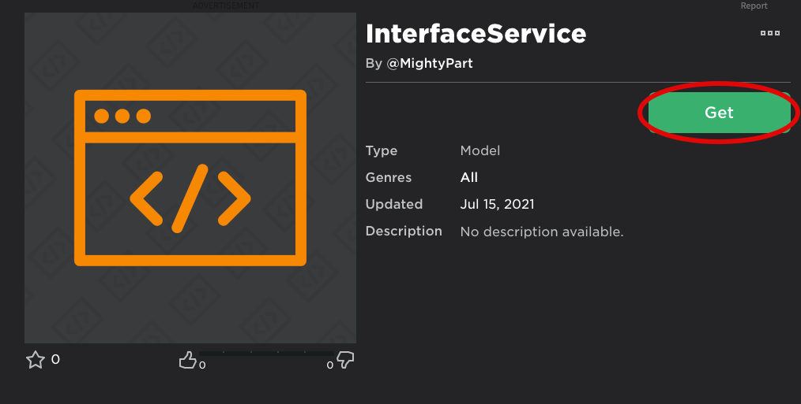
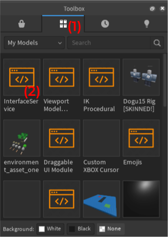

# Home

**InterfaceService** is a stand-alone ModuleScript that helps you script interactions with GUI Instances in a better, more efficient way! 

You can detect an interaction (such as left click) on multiple GUI Instances which is achievable without **InterfaceService** but it requires you to write out a for loop for every GUI Interaction you want, and if your script creates a new GUI Instance after the for loop then the Instance would be omitted from the loop as it did not exist at the time the loop was executed. **InterfaceService** aims to solve these problems.

## Example
``` lua
local interfaceService = require(game.ReplicatedStorage:WaitForChild("InterfaceService"))

-- function that fires whenever a GUI Instance with the ClassName of "TextButton" is left clicked
local leftClick = interfaceService:Get(".TextButton"):LeftClick(function(this)
	print(this.Name.." was clicked!")
end)

-- creates a new TextButton
newButton = interfaceService:Create({
	ClassName = "TextButton",
	Size = UDim2.new(0, 100, 0, 100),
	Position = UDim2.new(0.5, 0, 0.5, 0),
	AnchorPoint = Vector2.new(0.5, 0.5),
	Parent = script.Parent
})


-- has to update the leftClick function so "newButton" can be detected
leftClick:Update()
```

## Setup

* Add the ModuleScript to your Roblox inventory by clicking on the link [here](https://www.roblox.com/library/7098523825/InterfaceService).


* Go into Roblox Studio and open up the game you want to add InterfaceService to.

* Open up the Toolbox (`View` > `Toolbox`), then in the Toolbox window click the `Inventory` button <span style="color:red; font-size: 13px;">**(1)**</span>  then click on the InterfaceService ModuleScript <span style="color:red; font-size: 13px;">**(2)**</span>.  


* A ModuleScript called `Module` should now be in <span style="background-image: url('../images/workspace.png'); font-size: 14px;">​​      </span>`game.Workspace`. Rename it to `InterfaceService` and parent it to <span style="background-image: url('../images/repstorage.png'); font-size: 14px;">​      </span>`game.ReplicatedStorage`.

* To use InterfaceService in a local script you require it as shown below:
``` lua
local interfaceService = require(game.ReplicatedStorage:WaitForChild("InterfaceService"))
```
